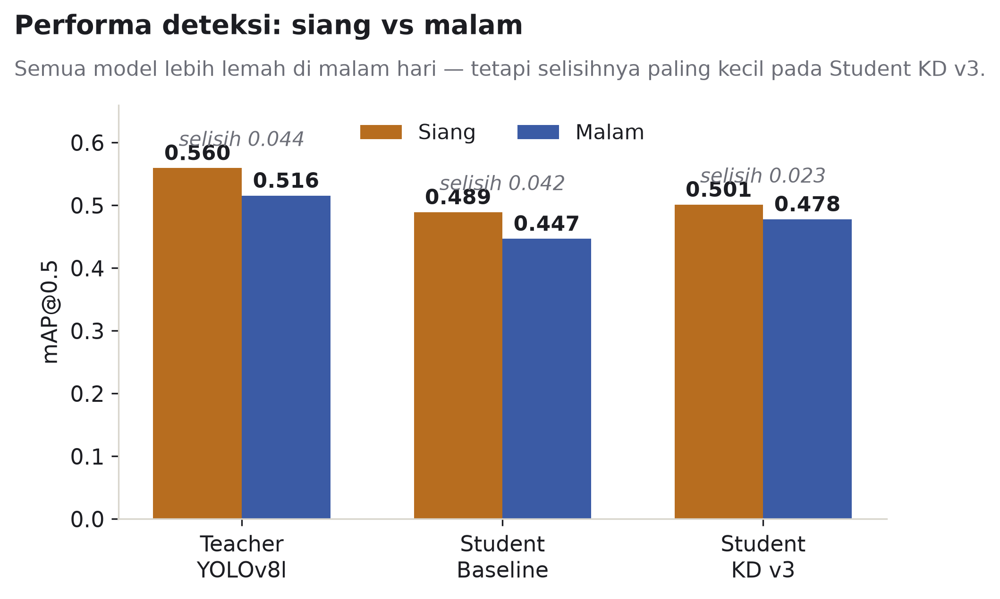
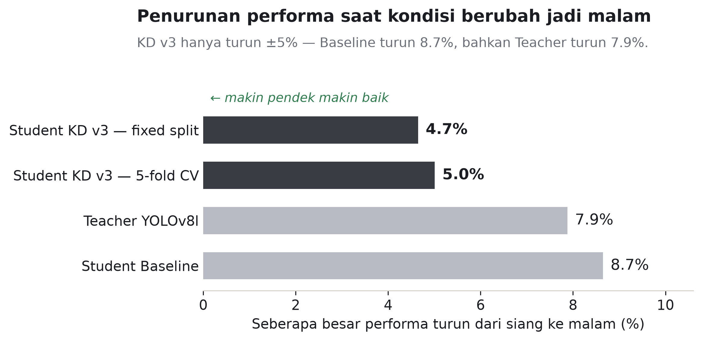
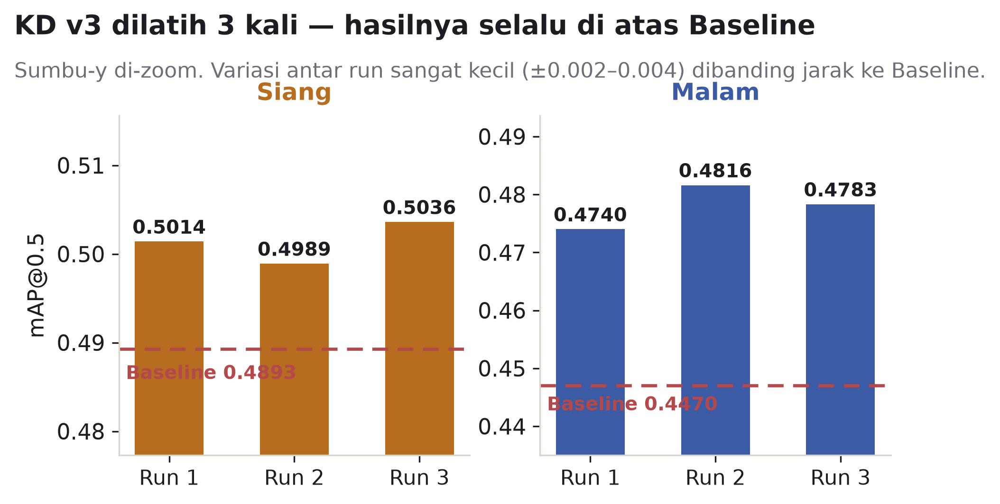
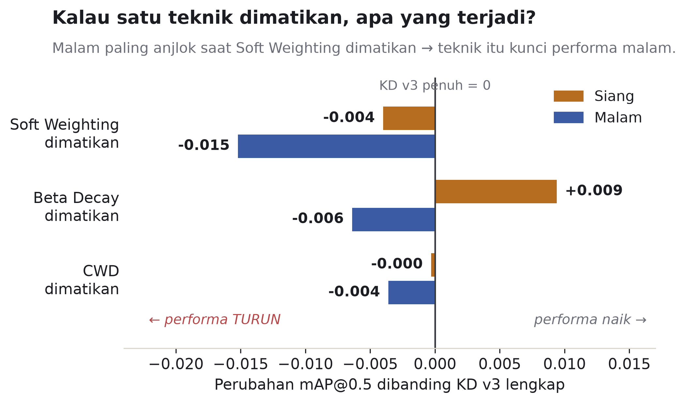
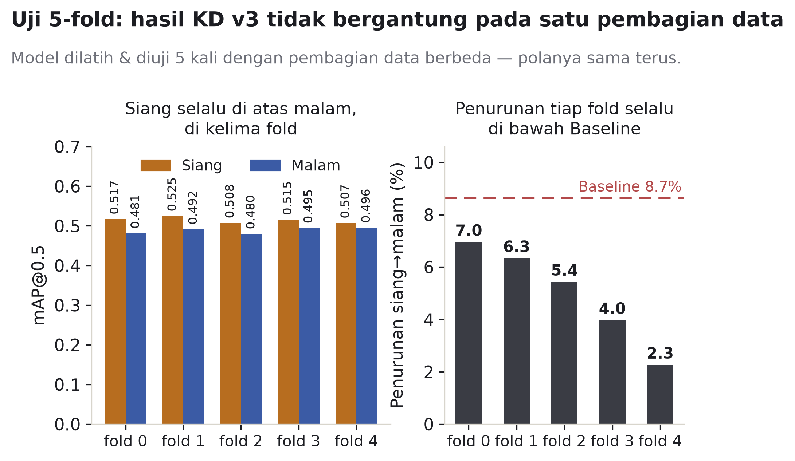
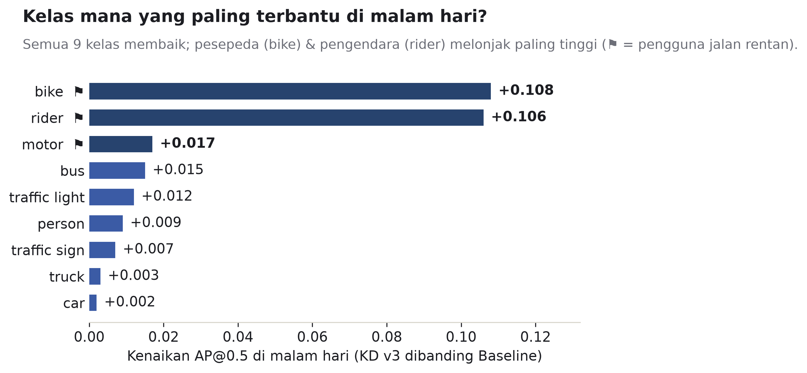

# 📊 Hasil Lengkap — Knowledge Distillation BDD100K (Day/Night)

Dokumen konsolidasi seluruh hasil eksperimen, siap dikutip untuk Bab 4 (Hasil &
Pembahasan) dan Bab 5 (Kesimpulan). Semua grafik ada di folder [`figures/`](figures/)
(PNG 300 dpi, siap dimasukkan ke dokumen skripsi). Tiap grafik diberi saran caption.

**Setup singkat:** Teacher YOLOv8l fine-tuned (~43.6M param) → Student YOLOv8s
(~11.1M param, kompresi ~3.9×). Dataset BDD100K 9 kelas (kelas `train` di-exclude),
train 10k siang + 10k malam, val/test 2k+2k per split, 640×640, 50 epoch.
KD v3 = soft confidence weighting + beta cosine schedule (0.35→0.10) + CWD (τ=4).

---

## 1. Hasil Utama — Semua Model (fixed split)

| Model | mAP50 Siang | mAP50 Malam | mAP50-95 Siang | mAP50-95 Malam | Gap Siang−Malam | Penurunan Relatif |
|---|---:|---:|---:|---:|---:|---:|
| Teacher YOLOv8l FT | 0.5597 | 0.5156 | 0.3261 | 0.2819 | 0.0441 | 7.88% |
| Student Baseline | 0.4893 | 0.4470 | 0.2771 | 0.2420 | 0.0423 | 8.65% |
| **Student KD v3** (mean 3 run) | **0.5013** | **0.4780** | **0.2834** | **0.2586** | **0.0233** | **4.65%** |

Penurunan relatif = (mAP50 siang − mAP50 malam) / mAP50 siang.

**Temuan kunci:**
- KD v3 unggul dari Baseline di kedua kondisi: siang **+0.0120**, malam **+0.0310** mAP50.
- **Gap siang-malam KD v3 (0.0233) hampir separuh gap Baseline (0.0423)** — dan
  lebih kecil pula dari gap Teacher-nya sendiri (0.0441). Student hasil distilasi
  lebih tahan perubahan pencahayaan (secara relatif) daripada teacher maupun baseline.
- KD v3 mempertahankan ~89.6% (siang) dan ~92.7% (malam) performa teacher dengan
  parameter ~3.9× lebih sedikit.

> **Saran caption:** *Gambar 4.1 — Perbandingan mAP@0.5 kondisi siang (●) dan malam (◆)
> untuk Teacher, Student Baseline, dan Student KD v3. Panjang garis menunjukkan
> kesenjangan (gap) performa antar kondisi pencahayaan; Student KD v3 memiliki gap
> terkecil (0.0233), hampir separuh gap Student Baseline (0.0423).*

> **Saran caption:** *Gambar 4.2 — Penurunan relatif mAP@0.5 dari kondisi siang ke malam.
> Student KD v3 (4.65% pada fixed split; 5.01% pada validasi 5-fold) turun hampir
> separuh dibanding Student Baseline (8.65%), bahkan lebih rendah dari Teacher (7.88%).*

---

## 2. Konsistensi Antar-Run — KD v3, 3 Training Independen (fixed split)

Konfigurasi identik, tanpa seed eksplisit — variasi murni dari inisialisasi,
augmentasi, dan non-determinism CUDA.

| Run | mAP50 Siang | mAP50 Malam | mAP50-95 Siang | mAP50-95 Malam |
|---|---:|---:|---:|---:|
| Run 1 | 0.5014 | 0.4740 | 0.2836 | 0.2543 |
| Run 2 | 0.4989 | 0.4816 | 0.2838 | 0.2602 |
| Run 3 | 0.5036 | 0.4783 | 0.2828 | 0.2612 |
| **Mean ± SD** | **0.5013 ± 0.0024** | **0.4780 ± 0.0038** | **0.2834 ± 0.0005** | **0.2586 ± 0.0037** |

**Temuan kunci:** selisih KD v3 terhadap Baseline = **5.1× SD** (siang) dan
**8.1× SD** (malam) — noise antar-run jauh lebih kecil dari gap yang diklaim,
sehingga peningkatan bukan kebetulan satu run.

> **Saran caption:** *Gambar 4.3 — Hasil tiga run training independen Student KD v3
> dengan konfigurasi identik. Ketiga run konsisten berada di atas Baseline (garis
> putus-putus) pada kedua kondisi; simpangan baku antar-run (±0.0024 siang, ±0.0038
> malam) jauh lebih kecil daripada selisih terhadap Baseline.*

---

## 3. Ablation Study — Kontribusi Tiap Teknik (leave-one-out)

Tiap eksperimen menonaktifkan **satu** teknik KD v3 (dikembalikan ke versi pra-v3),
dua teknik lain tetap aktif. Pembanding: mean ± SD dari 3 run KD v3 penuh.
Efek dinyatakan juga dalam satuan SD noise antar-run (×SD).

| Ablation (teknik yang dimatikan) | mAP50 Siang | Δ vs KD v3 | mAP50 Malam | Δ vs KD v3 |
|---|---:|---:|---:|---:|
| No Soft Weighting (#1 → hard mask) | 0.4973 | −0.0040 (−1.7×SD) | 0.4628 | **−0.0152 (−4.0×SD)** |
| No Beta Decay (#2 → beta konstan 0.225) | 0.5107 | **+0.0094 (+3.9×SD)** | 0.4716 | −0.0064 (−1.7×SD) |
| No CWD (#3 → MSE feature) | 0.5010 | −0.0003 (−0.1×SD) | 0.4744 | −0.0036 (−0.9×SD) |

**Temuan kunci:**
- **Soft confidence weighting = kontributor terbesar untuk Malam** (−4.0×SD bila
  dimatikan — jauh di luar noise band, hampir pasti efek nyata).
- **Beta cosine schedule = kontributor terbesar untuk Siang** (arahnya dua sisi:
  mematikannya menaikkan Siang tapi menurunkan Malam — trade-off yang justru
  diseimbangkan oleh schedule).
- **CWD berefek paling kecil**; kedua deltanya di dalam/tepi noise band sehingga
  belum dapat dipastikan signifikan dari 1 run ablation (butuh pengulangan).

> **Saran caption:** *Gambar 4.4 — Dampak menonaktifkan tiap teknik KD v3 (leave-one-out)
> terhadap mAP@0.5, relatif terhadap KD v3 penuh (rata-rata 3 run). Angka ×SD menyatakan
> besar efek dalam satuan simpangan baku noise antar-run. Soft confidence weighting
> berkontribusi paling besar pada kondisi malam; beta cosine schedule pada kondisi siang.*

---

## 4. Validasi 5-Fold Cross-Validation — KD v3

Test tiap fold diambil eksklusif dari gambar yang **tidak pernah dilihat teacher**
(unseen pool ~27.6k dari direktori val+test resmi), disjoint antar fold, stratified
multilabel (siang/malam + bin jumlah objek per kelas). Train di-subsample dengan
seed berbeda per fold. Detail desain: [`kfold/README.md`](kfold/README.md).

| Fold | mAP50 Siang | mAP50 Malam | mAP50-95 Siang | mAP50-95 Malam | Penurunan Relatif |
|---|---:|---:|---:|---:|---:|
| fold 0 | 0.5174 | 0.4814 | 0.2968 | 0.2612 | 6.96% |
| fold 1 | 0.5249 | 0.4916 | 0.2968 | 0.2630 | 6.34% |
| fold 2 | 0.5076 | 0.4800 | 0.2896 | 0.2644 | 5.44% |
| fold 3 | 0.5153 | 0.4948 | 0.2927 | 0.2738 | 3.98% |
| fold 4 | 0.5073 | 0.4958 | 0.2903 | 0.2648 | 2.27% |
| **Mean ± SD** | **0.5145 ± 0.0074** | **0.4887 ± 0.0075** | **0.2932 ± 0.0034** | **0.2654 ± 0.0049** | **5.00% ± 1.89%** |

**Temuan kunci:**
- **Siang mengungguli malam pada seluruh 5 fold tanpa kecuali** (juga pada mAP50-95) —
  arah efek 100% konsisten terhadap variasi pembagian data.
- Penurunan relatif rata-rata 5.00%, konvergen dengan hasil fixed-split 3-run (4.65%),
  dan keduanya jauh di bawah Baseline (8.65%) — **dua skema validasi independen
  (multi-seed & multi-fold) menghasilkan kesimpulan yang sama**.
- Magnitudo gap bervariasi antar fold (2.27–6.96%): arah stabil, besaran sensitif
  terhadap komposisi data uji — wajar dan dilaporkan apa adanya.

> **Saran caption:** *Gambar 4.5 — Hasil validasi 5-fold cross-validation Student KD v3.
> (kiri) mAP@0.5 siang dan malam per fold; kondisi siang unggul pada seluruh fold.
> (kanan) Penurunan relatif per fold; rata-rata 5.00% (garis abu-abu), seluruh fold
> berada di bawah penurunan relatif Baseline sebesar 8.65% (garis merah).*

---

## 5. Per-Kelas — Peningkatan Kondisi Malam (KD v3 mean 3 run vs Baseline)

| Kelas | AP50 Malam Baseline | AP50 Malam KD v3 | Δ | Kategori |
|---|---:|---:|---:|---|
| bike | 0.2479 | 0.3561 | **+0.1082** | VRU |
| rider | 0.3143 | 0.4198 | **+0.1055** | VRU |
| motor | 0.2629 | 0.2798 | +0.0169 | VRU |
| bus | 0.3984 | 0.4137 | +0.0153 | |
| traffic light | 0.5164 | 0.5285 | +0.0121 | |
| person | 0.4885 | 0.4978 | +0.0093 | |
| traffic sign | 0.6053 | 0.6122 | +0.0069 | |
| truck | 0.4692 | 0.4721 | +0.0029 | |
| car | 0.7198 | 0.7216 | +0.0018 | |

**Temuan kunci:** KD v3 unggul dari Baseline pada **9/9 kelas** di kondisi malam,
dengan lonjakan terbesar justru pada kelas *vulnerable road user* — `bike` (+0.1082)
dan `rider` (+0.1055) — kelas yang paling kritis untuk keselamatan pada skenario
berkendara malam hari.

> **Saran caption:** *Gambar 4.6 — Peningkatan AP@0.5 per kelas pada kondisi malam
> (Student KD v3, rata-rata 3 run, terhadap Student Baseline). Peningkatan terbesar
> terjadi pada kelas vulnerable road user (⚑): bike dan rider naik lebih dari 0.10 poin.*

---

## 6. Catatan Metodologis & Limitasi (penting untuk Bab 4/5)

1. **Angka mentah k-fold ≠ angka fixed-split.** Test set k-fold (±3.140 siang +
   2.393 malam per fold, dari gabungan direktori val+test resmi) berbeda komposisi
   dari test set fixed-split (2.000+2.000 subsample direktori test). Yang sah
   dibandingkan lintas kedua skema: **arah efek dan penurunan relatif (%)** — bukan
   nilai mAP mentahnya.
2. **Baseline & ablation masing-masing 1 run.** SD hanya dimiliki KD v3 (3 run) dan
   k-fold (5 fold). Klaim perbandingan vs Baseline bersandar pada rasio gap-terhadap-noise
   (5–8×SD), bukan uji signifikansi formal dua sampel.
3. **K-fold hanya untuk KD v3** (teacher beku — sah karena test fold seluruhnya
   teacher-unseen; baseline tidak di-fold). Klaim k-fold = stabilitas KD v3 terhadap
   variasi pembagian data, bukan "menang vs baseline di tiap fold".
4. **Efek CWD belum konklusif** (≤0.9×SD dari 1 run ablation) — dilaporkan sebagai
   temuan awal yang memerlukan pengulangan, bukan kesimpulan pasti.

## 7. Sumber Data Mentah

| Eksperimen | Lokasi file |
|---|---|
| Eval final semua model (fixed split) | `final_evaluation_9class/`, `final_evaluation_hyperparameter_tuning_kd/` |
| Konsistensi 3 run KD v3 | `consistency_check/` |
| Ablation study | `ablation_study/{01_no_soft_weighting,02_no_beta_decay,03_no_cwd}/` |
| 5-fold cross-validation | `kfold/` (`folds.json`, `kfold_summary.csv`) |
| Script grafik | `figures/` (dihasilkan dari data di atas) |
