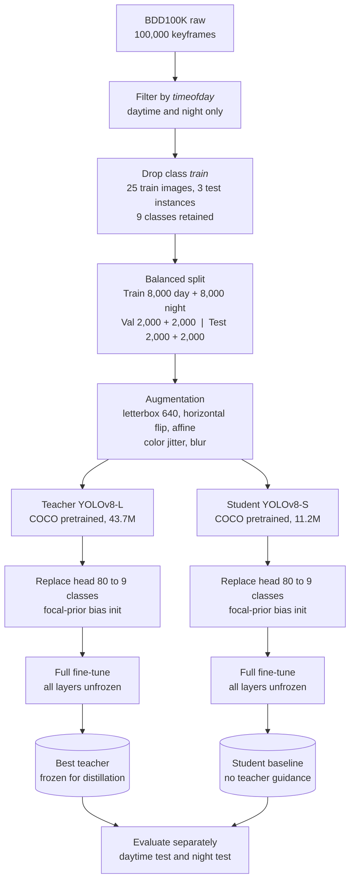
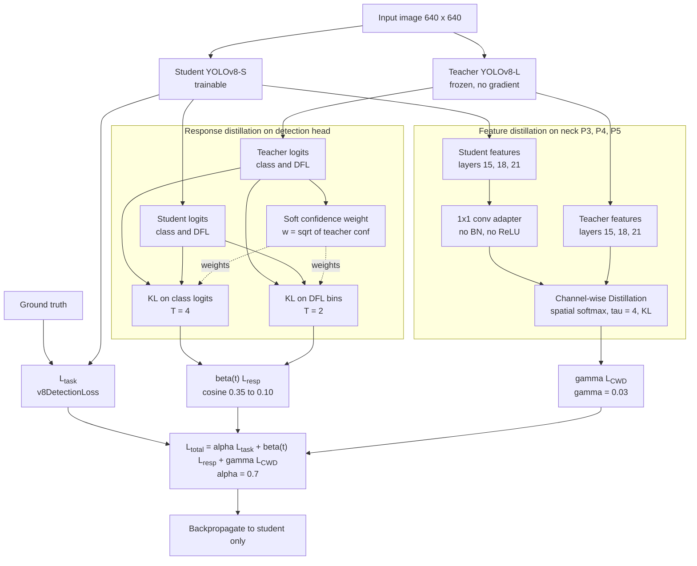
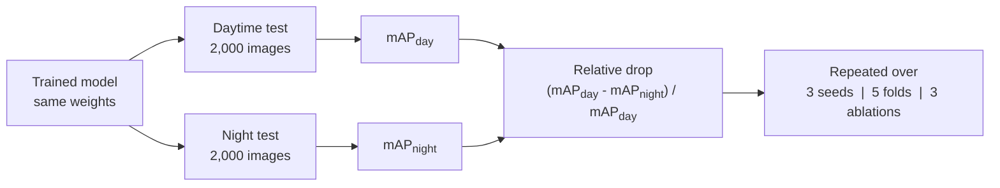

# Revisi Naskah: Judul, Abstract, Bab I sampai III, Diagram, Referensi

Dokumen ini berisi tiga hal: daftar apa saja yang harus diubah, teks pengganti yang siap ditempel ke naskah, dan referensi baru. Bagian yang berbahasa Inggris adalah teks naskah. Bagian yang berbahasa Indonesia adalah catatan untuk kalian.

Gaya bahasa naskah dipertahankan seperti draft kalian, hanya dipadatkan. Semua penyebutan "v3", "KD v3", "tuned", dan "v1" dihapus. Model hasil distilasi cukup disebut **Student KD** atau **the distilled student**.

---

## 0. Daftar perubahan wajib

Ini yang harus diubah, urut dari yang paling berisiko kalau lolos.

| # | Lokasi | Masalah | Perbaikan |
|---|---|---|---|
| 1 | Ref [4] | Ditulis "in CVPR, 2024". **Salah.** Papernya preprint arXiv 2604.26857, April 2026 | Ganti entri referensi, lihat Bagian 7 |
| 2 | Bab IV.F | Ada sitasi rusak `[?]` di kalimat "align with Karjol & Hanna [?]" | Ganti jadi [4] |
| 3 | Tabel V, baris No CWD | Naskah menulis 0,5010 siang / 0,4744 malam. Angka yang kalian kirim ke saya sebelumnya 0,5003 / 0,4682. **Beda.** Kesimpulan di Bab IV.C ("Minor / Within Noise") ikut berubah kalau angka yang benar 0,4682 | Cek ulang file evaluasi ablation no-CWD, pakai satu angka yang benar |
| 4 | Bab III.D | Tertulis "adapted to have a 10-class detection head" | Ganti jadi 9-class, karena kelas train sudah dikeluarkan |
| 5 | Tabel II | β = 0,3 konstan, γ = 0,1, patience 7. Ini konfigurasi lama, bukan yang dipakai di kode final | Ganti dengan Tabel II baru di Bagian 5 |
| 6 | Bab III.E | Masih menulis "MSE Loss" untuk feature distillation dan tidak menyebut soft weighting maupun beta schedule | Ganti seluruh III.E dan III.F dengan teks baru di Bagian 5 |
| 7 | Bab IV.D | Menulis test set 5-fold diambil dari "~27,600 images from the official BDD100K validation and test directories". Tabel I menulis total 24.000. Dua angka ini tidak nyambung | Jelaskan pool mana yang dipakai untuk fold, atau samakan |
| 8 | Fig 3 caption | Menyebut simbol (•) dan (♦) padahal gambarnya bar chart | Ganti caption |
| 9 | Ref [16] | Ditulis CVPR 2024. Papernya terbit di ACM Multimedia 2023 | Perbaiki |
| 10 | Ref [19] | Ditulis CVPR 2024. Papernya terbit di IEEE Geoscience and Remote Sensing Letters 2024 | Perbaiki |
| 11 | Ref [21] | Ditulis "X. C. et al." | Ganti "X. Cao, Y. Hu, and H. Zhang" |
| 12 | Seluruh naskah | "Student KD v3", "KD v3" muncul di Bab IV, V, semua tabel dan caption | Ganti jadi "Student KD" |
| 13 | Abstract, Index Terms | Masih kosong | Isi, lihat Bagian 2 |
| 14 | Judul | Menyebut low-light, padahal yang diuji adalah selisih siang dan malam | Ganti, lihat Bagian 1 |
| 15 | Fig 1 dan Fig 2 | Diagram lama | Ganti dengan versi Mermaid di Bagian 5 |
| 16 | Eq (2) | Definisi relative drop ada di Bab IV padahal itu bagian metode | Pindahkan ke III.G |

Nomor 3 yang paling mendesak. Kalau angka no-CWD yang benar adalah 0,4682, maka kesimpulan Bab IV.C harus dibalik: CWD bukan "minor", tapi komponen yang paling spesifik malam.

---

## 1. Judul

Judul lama menyebut *low-light*, padahal metrik utama kalian adalah selisih performa siang ke malam pada satu model. Judul harus mencerminkan itu.

**Rekomendasi:**

> **Narrowing the Day-to-Night Performance Gap of Lightweight YOLOv8 Detectors via Knowledge Distillation**

Alternatif kalau mau lebih pendek:

> **Illumination-Robust Knowledge Distillation for Lightweight Driving Scene Object Detection**

Alternatif kalau mau menyebut dataset:

> **Day-to-Night Robustness of Distilled YOLOv8 Students on BDD100K**

Saya sarankan yang pertama. Kata *narrowing the gap* langsung memberi tahu pembaca apa yang diukur, dan *lightweight* menegaskan batasan edge.

---

## 2. Abstract dan Index Terms

**Abstract**

Object detectors deployed on in-vehicle edge hardware must operate under both daylight and darkness with a single model, yet lightweight detectors degrade sharply at night. Prior work has shown that knowledge distillation (KD) confers robustness to INT8 quantization on edge-deployable YOLOv8 students, but left the effect of illumination change unexamined. This paper closes that gap. We distill a fine-tuned YOLOv8-L teacher (43.7M parameters) into a YOLOv8-S student (11.2M parameters) on a balanced daytime and nighttime subset of BDD100K, and evaluate every model separately on each condition. The distillation framework combines three mechanisms, each chosen against a specific nighttime failure mode: soft confidence weighting so that low-confidence nighttime objects are not discarded, a cosine-decayed distillation weight so that the teacher does not dominate late training, and channel-wise feature distillation so that the student matches the teacher's spatial attention rather than illumination-dependent activation magnitudes. Averaged over three independent training runs, the distilled student raises nighttime mAP@0.5 from 0.4470 to 0.4780 (+0.0310, 8.1 standard deviations) while also improving daytime mAP@0.5 (+0.0120), and halves the relative day-to-night drop from 8.65% to 4.65%, lower than the teacher's own 7.88%. Gains hold across all nine classes in both conditions, with the largest improvements on vulnerable road users at night (bicycle +0.108, rider +0.106 AP@0.5). A leave-one-out ablation shows the three components play distinct roles, and a stratified five-fold cross-validation confirms the direction of the effect. No inference-time cost is added: the deployed model is an unmodified YOLOv8-S.

**Index Terms:** knowledge distillation, object detection, YOLOv8, low-light, day-to-night domain gap, edge deployment, BDD100K, autonomous driving.

---

## 3. Bab I: Introduction

> Catatan: paragraf pertama dan kedua dipadatkan dari draft kalian. Paragraf ketiga dan keempat baru, karena di situ posisi terhadap Karjol dan Hanna ditegaskan. Kontribusi ditulis eksplisit di akhir.

Object detection is one of the fundamental modules in computer vision for intelligent transport systems, enabling the real-time identification and localisation of obstacles and pedestrians in the vicinity of a vehicle. Although these perception systems demonstrate reliable performance under adequate lighting conditions, their reliability decreases significantly in low-light driving environments and at night [1], [2]. Insufficient lighting causes under- and over-exposure, motion blur, and glare from headlamps, which degrade the quality of camera measurements before any detector is applied [30]. The consequence is not academic: in the United States, 76.3% of pedestrian fatalities occur in dark conditions [37], and from September 2029 federal rule FMVSS No. 127 requires that pedestrian automatic emergency braking on all new light vehicles detect pedestrians "in both daylight and darkness" [36]. The same on-board system must therefore serve both conditions.

To ensure vehicle safety, such perception models must run on in-vehicle edge devices such as the NVIDIA Jetson platform, which impose strict limits on memory and inference latency [4], [5]. Consequently, lightweight one-stage detectors, particularly the YOLO family, are preferred for their balance between speed and accuracy [5]–[7]. However, these compact models have limited representational capacity, making them more susceptible to the feature degradation and sensor noise encountered at night [1], [5]. Approaches that address low-light detection through image enhancement or domain adaptation typically add computation at inference or require additional training pipelines, which is impractical for edge deployment [2], [3]. Knowledge distillation (KD) avoids this cost entirely: the teacher is present only during training, and the deployed model is the unmodified student [8], [9], [35].

Karjol and Hanna [4] recently showed that distilling a YOLOv8-L teacher into a YOLOv8-S student on BDD100K confers robustness to INT8 quantization, with the distilled student losing only 5.6% mAP where the teacher loses 23%. Their analysis, however, treats daytime and nighttime images as a single pool, and the authors explicitly identify "stratified analysis by lighting conditions (day/night)" as future work. This matters because an aggregate mAP can conceal a model that performs well by day and collapses at night [32], and because training on one illumination condition alone is known to sacrifice the other [31]. Whether KD also transfers robustness to a change in illumination, on the same lightweight student and the same dataset, has not been examined.

This paper addresses that question. We follow the YOLOv8-L to YOLOv8-S distillation pipeline of [4] on BDD100K, but train on a balanced daytime and nighttime subset and evaluate every model separately on each condition, reporting the relative day-to-night performance drop [33] alongside absolute accuracy. The distillation framework combines multi-level feature alignment on the P3 to P5 neck with response distillation on classification logits and bounding-box distributions, and introduces three mechanism choices targeted at nighttime failure modes. The contributions are as follows:

1. **A day- and night-disaggregated evaluation of distilled lightweight detectors.** Averaged over three independent training runs, the distilled YOLOv8-S improves nighttime mAP@0.5 by +0.0310 (8.1 standard deviations) without reducing daytime accuracy, and halves the relative day-to-night drop from 8.65% to 4.65%.
2. **Evidence that the effect is illumination-specific.** Nighttime gains are nearly three times larger than daytime gains, and the distilled student degrades less under illumination change than its own teacher (7.88%).
3. **A component-level explanation.** A leave-one-out ablation shows that soft confidence weighting contributes most to nighttime accuracy, channel-wise distillation acts almost exclusively at night, and the cosine distillation schedule prevents the student from over-fitting daytime at the expense of robustness.
4. **Validation across protocols.** The direction and magnitude of the effect hold under a fixed split with three repeated runs and under stratified five-fold cross-validation, and the deployed model adds no inference-time cost.

---

## 4. Bab II: Related Work

> Catatan: subbab A, C, D dipadatkan dari draft. Subbab B ditulis ulang menjadi empat keluarga KD, karena kalian memakai keempatnya. Subbab E baru, untuk landasan metrik.

### A. Object Detection in Low-Light Driving Environments

Nighttime object detection is difficult because of low illumination, sensor noise, and motion blur [1], [2]. Camera gain and exposure limitations produce poorly lit images with backlighting, so that classical detectors such as RetinaNet and YOLOv3 fail on under-illuminated road users [1]. Cui et al. [30] characterise the problem for BDD100K directly: detectors trained on well-lit daytime images "suffer from poor performance on low-light nighttime images" owing to under- and over-exposure, motion blur, and headlamp glare, and they establish the practice of splitting BDD100K by its *day* and *night* labels as the standard day-to-night benchmark.

Two families of remedies exist. Image enhancement methods such as LIME and SID brighten the input before detection [2], [3], and augmentation strategies such as NUDN and LightImg transform nighttime features toward daytime [2]. Domain adaptation methods, including RMD-Net [1], 2PCNet [38], and Debiased Teacher [30], adapt a detector trained on labelled daytime images to unlabelled nighttime images. Both families add complexity: enhancement adds an inference-time sub-network and can introduce domain mismatch [3], while domain adaptation targets the setting where nighttime labels are unavailable and reports nighttime accuracy only. Neither reports how much a single deployed model loses when its operating condition changes from day to night.

### B. Knowledge Distillation for Object Detection

KD trains a small student to reproduce the behaviour of a larger teacher [35]. For detectors, four families of transferred knowledge are commonly distinguished [11], [13].

*Response-based distillation* matches the student's class logits to the teacher's temperature-softened distribution, transferring inter-class similarity absent from one-hot labels [35]; decoupled KD separates target and non-target classes [11], and CrossKD forwards student features through the teacher head [15].

*Localization distillation* treats the bounding-box regression as a distribution over discrete bins and distils that distribution, transferring localisation uncertainty that a single box coordinate cannot carry [9], [20]. This is particularly relevant at night, where object boundaries are blurred.

*Feature-based distillation* aligns intermediate representations. Early methods imitate activation maps with an MSE loss [12], [13]; FGD separates foreground from background [12], and Shared-KD addresses cross-layer discrepancy [14]. Channel-wise distillation (CWD) [22] instead normalises each channel into a spatial probability map with a softmax and minimises the KL divergence, so that the student learns *where* the teacher attends rather than the raw magnitude of activation. PKD reaches a similar conclusion via Pearson correlation, arguing that magnitude matching imposes an overly strict constraint and lets large-magnitude features dominate the gradient [29]. CWD remains in active use on YOLO detectors in 2025 [28].

*Instance or region weighting* recognises that not all anchors deserve equal distillation weight. Adaptive Instance Distillation weights each instance by teacher prediction [17], Gradient-guided KD by gradient magnitude [8], and Prediction-Guided Distillation by a continuous teacher quality score in place of a binary foreground mask [23]; recent work replaces hand-set thresholds with continuous importance scores derived from the detector's own outputs [24].

A further design axis is *when* distillation is emphasised. Annealing KD introduced a schedule that hands the student from soft targets to hard labels over training [26]; task-adaptive regularisation applied a per-epoch decay to the distillation weight for detectors [25]; and recent work argues that a fixed distillation weight or temperature throughout training is sub-optimal [27].

The present framework uses all four families and applies a training schedule to the distillation weight. To our knowledge, no prior detection work combines continuous teacher-confidence weighting, a scheduled distillation weight, and distribution-normalised feature distillation in a single framework, although each component has independent precedent.

### C. Edge AI Deployment and Model Compression

In-vehicle deployment is constrained by memory, latency, and model size [4], [5]. INT8 quantization reduces memory four-fold but degrades large models such as YOLOv8-L substantially [4]. Karjol and Hanna [4] show that a YOLOv8-S student distilled from a YOLOv8-L teacher on BDD100K retains accuracy under INT8 (−5.6% mAP) where the teacher collapses (−23%), and attribute the effect to the transfer of confidence calibration rather than raw detection capacity. Pruning combined with KD has likewise been used to recover accuracy of very light YOLO models under low light [5], [10], and KD has been applied to lightweight YOLOv8 for infrared detection on edge devices [21]. These works establish that distillation makes compact detectors more deployable; none of them separates the evaluation by illumination condition.

### D. Robustness Evaluation Under Condition Shift

Reporting a single aggregate mAP is insufficient when the operating condition varies. Liu et al. [32] construct BDD100K-C and conclude that "high mAP does not guarantee robustness": the ranking of detectors on clean data does not hold under corruption. Jones et al. [31] show that a detector trained on nighttime images alone loses daytime performance, and that a mixed training set is required to hold both. Dai et al. [33] formalise the relative performance drop, the loss under a shifted condition divided by the reference performance, as the quantity that allows fair comparison between models with different baseline accuracy. Day-to-night domain adaptation methods bracket a related gap between a daytime-trained and a nighttime-trained model [30], [38]; the present work instead measures the gap of one deployed model across the two conditions.

### E. Dataset and Research Positioning

BDD100K is a large driver-oriented dataset of 100,000 keyframes with heterogeneous annotations and a native *timeofday* attribute [34], which makes it the standard choice for day-to-night evaluation [30], [38]. It is preferred over ExDark and DarkFace, which lack a daytime counterpart, over nuScenes, whose nighttime share is small, and over synthetic datasets such as SHIFT, whose transfer to deployment is uncertain.

This study sits at the intersection of four requirements that no single prior work satisfies together: a lightweight edge-deployable detector, a natural day-to-night illumination shift on real driving images, distillation from a separate large teacher, and the relative performance drop as a reported metric. Karjol and Hanna [4] satisfy three of the four and name the fourth as future work; Cui et al. [30] address the illumination shift but on a two-stage detector without a compression objective and without reporting the drop; Cao et al. [21] distil a lightweight YOLOv8 but on infrared imagery with a single distillation path. The present work fills the remaining cell.

---

## 5. Bab III: Methodology

> Catatan: III.A, III.B, III.C dipadatkan. III.D, III.E, III.F ditulis ulang total karena kodenya berubah. III.G diperluas dengan protokol evaluasi dan definisi relative drop yang dipindah dari Bab IV.

### A. Dataset Acquisition and Partitioning

The data are drawn from BDD100K [34]. Images were first filtered by the *timeofday* attribute to retain only daytime (sufficient illumination, P_S) and nighttime (insufficient illumination, P_L) scenes. The class *train* was excluded: it contributes only 25 training images and 3 test instances, an imbalance ratio of 791 against *car*, so that its average precision is statistically meaningless and distorts the class mean. Nine classes remain: bike, bus, car, motor, person, rider, traffic light, traffic sign, and truck. The entire pipeline was retrained with the nine-class head rather than filtered at evaluation time.

Daytime and nighttime images were sampled in equal number at every split, as shown in Table I, so that any performance difference between the two conditions can be attributed to illumination rather than to data quantity.

**TABLE I. BDD100K Dataset Partitioning** *(tidak berubah dari draft)*

| Split | Daytime (P_S) | Nighttime (P_L) | Total |
|---|---|---|---|
| Training | 8,000 | 8,000 | 16,000 |
| Validation | 2,000 | 2,000 | 4,000 |
| Testing | 2,000 | 2,000 | 4,000 |
| Total | 12,000 | 12,000 | 24,000 |

### B. Research Pipeline

The pipeline has three stages, illustrated in Fig. 1. The first establishes reference performance for the YOLOv8-L teacher and the YOLOv8-S student trained without guidance. The second distils the frozen teacher into a fresh YOLOv8-S student using the framework in Fig. 2. The third evaluates every model separately on the daytime and nighttime test sets under the protocol of Section III-G.

**Fig. 1.** Data preparation and reference training. *(Mermaid source di bawah; file PNG disertakan.)*

### C. Preprocessing and Augmentation

To improve robustness to the noise and motion blur of nighttime driving, a tailored augmentation set is applied [2], [8], [16]. Spatial transformations comprise letterbox resizing to 640 × 640, horizontal flipping, and affine transformation. Photometric transformations comprise colour jitter and blur, which simulate low luminance and blurred regions and encourage the model to learn features that are invariant to lighting [1].

### D. Training Configuration

Both models are initialised from COCO-pretrained weights. The 80-class detection head is replaced by a 9-class head whose classification bias is initialised with a focal-loss prior, so that the initial objectness probability is low and early training is stable. All layers are then fine-tuned. YOLOv8-L (43.7M parameters) serves as teacher owing to its representational capacity; YOLOv8-S (11.2M parameters) is the student, a 3.9× reduction. Optimisation uses AdamW with linear warm-up followed by cosine annealing, mixed precision, and gradient clipping. Early stopping monitors the mean of daytime and nighttime validation loss. Table II lists all hyperparameters.

**TABLE II. Hyperparameters and Training Configuration** *(ganti seluruh tabel lama)*

| Parameter | Value |
|---|---|
| Input resolution | 640 × 640 |
| Optimizer | AdamW, weight decay 0.05 |
| Initial learning rate | 1 × 10⁻⁴ |
| LR schedule | Linear warm-up 3 epochs (×0.1), then cosine annealing |
| Batch size | 16 |
| Max epochs (teacher FT / student baseline / KD) | 30 / 50 / 50 |
| Early stopping | Patience 14 on mean validation loss, min delta 1 × 10⁻⁴ |
| Mixed precision, gradient clipping | AMP, max norm 10 |
| Task loss weight α | 0.7 |
| Response distillation weight β(t) | Cosine decay from 0.35 to 0.10 over training |
| Feature distillation weight γ | 0.03 |
| Classification temperature T | 4.0 |
| DFL temperature T_dfl | 2.0 |
| CWD temperature τ | 4.0 |
| Feature layers | 15, 18, 21 (neck P3, P4, P5) |
| Adapter | 1 × 1 convolution, no BN, no activation |
| Anchor weight | w = √(max teacher class confidence) |

### E. Integrated Knowledge Distillation Framework

The framework transfers knowledge along three paths, shown in Fig. 2, and adds two mechanisms that govern how much and when the transfer is applied. All paths are active only during training; at inference the student runs unmodified.

**Feature distillation.** Feature maps are hooked from the neck at layers 15, 18, and 21, corresponding to P3, P4, and P5 [18], [19]. Because the student has fewer channels than the teacher at each level, a 1 × 1 convolutional adapter without normalisation or activation projects student features to the teacher's channel dimension. The projected student map and the teacher map are then compared with channel-wise distillation [22]: each channel is flattened over its spatial positions, passed through a softmax with temperature τ, and the KL divergence between the resulting student and teacher distributions is averaged over channels and levels. This replaces the mean-squared-error imitation used in earlier feature distillation [12], [13]. The choice is deliberate for the illumination setting: a change in lighting alters the magnitude of activations, so an MSE objective would force the student to reproduce values that are themselves illumination-dependent, whereas the spatial softmax discards magnitude and transfers only the teacher's attention pattern [22], [29].

**Response distillation.** At the detection head, the KL divergence is computed between the student's and the teacher's class logits, softened by temperature T and scaled by T² [35], and between their distribution focal loss (DFL) bin distributions with temperature T_dfl [9], [20]. The DFL term is retained because bounding-box distributions carry localisation uncertainty that is informative when object boundaries are blurred at night.

**Soft confidence weighting.** Rather than discarding anchors whose teacher confidence falls below a threshold, every anchor contributes to both response terms with a continuous weight w = √c_T, where c_T is the teacher's maximum class probability at that anchor, and the weighted sum is normalised by Σw [17], [23], [24]. The square root raises the contribution of mid-confidence anchors. This matters at night, where the objects the framework aims to recover are precisely those on which the teacher is only moderately confident; a hard threshold would remove them from supervision.

**Cosine distillation schedule.** The response weight β is not constant. It follows a cosine decay from 0.35 at the first epoch to 0.10 at the last, so that the student is guided strongly by the teacher while its own representation is immature, and is increasingly governed by ground truth late in training [25], [26], [27]. This also limits the influence of the teacher's own nighttime errors on the final student.

**Fig. 2.** Knowledge distillation framework. Shaded components are the three mechanism choices of this work. *(Mermaid source di bawah; file PNG disertakan.)*

### F. Mathematical Formulation of the Objective Function

The total loss combines task supervision with the three distillation terms:

$$L_{total} = \alpha\, L_{task} + \beta(t)\,\big(L_{cls} + L_{dfl}\big) + \gamma\, L_{CWD} \tag{1}$$

where L_task is the standard YOLOv8 detection loss on ground truth, and

$$L_{cls} = \frac{T^2}{\sum_i w_i}\sum_i w_i\, \mathrm{KL}\!\left(\sigma\!\left(\tfrac{z^T_i}{T}\right)\,\Big\|\,\sigma\!\left(\tfrac{z^S_i}{T}\right)\right), \qquad w_i = \sqrt{\max_c \sigma(z^T_{i,c})} \tag{2}$$

$$L_{dfl} = \frac{T_{dfl}^2}{\sum_i w_i}\sum_i w_i \cdot \frac{1}{4}\sum_{k=1}^{4} \mathrm{KL}\!\left(\sigma\!\left(\tfrac{d^T_{i,k}}{T_{dfl}}\right)\,\Big\|\,\sigma\!\left(\tfrac{d^S_{i,k}}{T_{dfl}}\right)\right) \tag{3}$$

$$L_{CWD} = \frac{1}{|\mathcal{L}|}\sum_{l\in\mathcal{L}} \frac{\tau^2}{C_l}\sum_{c=1}^{C_l} \mathrm{KL}\!\left(\sigma\!\left(\tfrac{F^T_{l,c}}{\tau}\right)\,\Big\|\,\sigma\!\left(\tfrac{\phi_l(F^S_l)_c}{\tau}\right)\right) \tag{4}$$

$$\beta(t) = \beta_{end} + \tfrac{1}{2}\,(\beta_{start} - \beta_{end})\left(1 + \cos\frac{\pi\, t}{E - 1}\right), \quad \beta_{start}=0.35,\ \beta_{end}=0.10 \tag{5}$$

Here i indexes anchors, z are class logits, d_{i,k} are the DFL bin logits for side k of anchor i, F_l are feature maps at level l ∈ {15, 18, 21} flattened over spatial positions, φ_l is the 1 × 1 adapter, C_l the channel count, σ the softmax over the last dimension, t the current epoch, and E the total number of epochs. Weights are α = 0.7 and γ = 0.03; the teacher is frozen throughout, and gradients flow to the student and the adapters only.

### G. Evaluation Protocol

Performance is reported as precision, recall, mAP@0.5, and mAP@0.5:0.95, computed with the standard per-class average precision procedure at a confidence threshold of 0.001. Every model is evaluated **separately** on the daytime and nighttime test sets of Table I, and the relative performance drop under illumination change [33] is reported as the primary robustness quantity:

$$\text{Relative Drop (\%)} = \frac{\mathrm{mAP}_{50,\text{day}} - \mathrm{mAP}_{50,\text{night}}}{\mathrm{mAP}_{50,\text{day}}} \times 100 \tag{6}$$

Normalising by daytime performance allows models with different absolute accuracy, such as the teacher and the student, to be compared on the same footing. Four complementary protocols are used (Fig. 3):

1. **Fixed split with repeated training.** The distilled student is trained three times from the same initialisation under non-deterministic CUDA execution, and results are reported as mean ± standard deviation. Improvements are expressed in multiples of this standard deviation.
2. **Stratified five-fold cross-validation.** Folds are drawn with multilabel stratification over the *timeofday* attribute and per-class instance counts, so that every fold preserves the day-night balance and the class distribution; the teacher is retrained per fold to avoid leakage.
3. **Leave-one-out ablation.** Each of the three mechanism choices in Section III-E is disabled in turn, with all other settings fixed, to measure its marginal contribution in each condition.
4. **Per-class analysis.** AP@0.5 is reported per class and per condition to identify where gains concentrate.

**Fig. 3.** Evaluation protocol. *(Mermaid source di bawah; file PNG disertakan.)*

---

## 6. Catatan untuk Bab IV dan V

Tidak saya tulis ulang, tapi ini yang harus disesuaikan supaya konsisten dengan Bab I sampai III yang baru:

- Ganti semua "Student KD v3" dan "KD v3" menjadi "Student KD". Termasuk judul Tabel III, IV, V, VII dan caption Fig 3 sampai 8.
- Hapus Eq (2) dari Bab IV.A karena sudah pindah ke III.G sebagai Eq (6). Ganti kalimatnya menjadi "the relative drop defined in Eq. (6)".
- Tabel V: kolom pertama menyebut "#1", "#2", "#3" dan "β = 0.225". Ganti jadi nama komponen saja tanpa nomor, dan cek nilai β konstan yang benar-benar dipakai di notebook ablation no-beta.
- Tabel V baris No CWD: pastikan angkanya. Kalau yang benar 0,4682 malam, ganti "Minor / Within Noise" menjadi "Night-specific" dan tulis ulang butir ketiga di IV.C.
- IV.D: jelaskan asal 27.600 gambar untuk 5-fold, karena berbeda dari 24.000 di Tabel I. Kalau fold diambil dari pool yang lebih besar, tulis eksplisit, dan sebutkan bahwa teacher dilatih ulang per fold.
- IV.F butir pertama: sitasi `[?]` ganti [4].
- V.A butir pertama: tambahkan satu kalimat bahwa temuan ini mengisi celah yang dinyatakan di [4].
- Fig 3 caption: hapus "(•) and (♦)". Ganti "Bars show mAP@0.5 under daytime and nighttime conditions; the number above each pair is the absolute gap."

---

## 7. Referensi

### 7.1 Yang dipertahankan, dengan perbaikan

Semua referensi [1] sampai [21] tetap dipakai. Tiga yang harus diperbaiki entrinya:

**[4]** A. Karjol and D. M. Hanna, "Edge AI for automotive vulnerable road user safety: Deployable detection via knowledge distillation," *arXiv preprint* arXiv:2604.26857, Apr. 2026.
*(Bukan CVPR 2024. Cek sekali lagi apakah sudah terbit di venue formal saat naskah difinalkan.)*

**[16]** J. Liang et al., "Exploring inconsistent knowledge distillation for object detection with data augmentation," in *Proc. ACM Int. Conf. Multimedia (MM)*, 2023.
*(Bukan CVPR 2024.)*

**[19]** L. Yao et al., "Domain-invariant progressive knowledge distillation for UAV-based object detection," *IEEE Geosci. Remote Sens. Lett.*, vol. 21, 2024.
*(Bukan CVPR 2024.)*

**[21]** X. Cao, Y. Hu, and H. Zhang, "LKD-YOLOv8: A lightweight knowledge distillation-based method for infrared object detection," *Sensors*, vol. 25, no. 13, p. 4054, 2025.
*(Penulis pertama Xiancheng Cao, bukan "X. C.")*

### 7.2 Yang ditambahkan

Nomor dilanjutkan dari [21]. Urutan boleh disesuaikan dengan urutan kemunculan di naskah.

**[22]** C. Shu, Y. Liu, J. Gao, Z. Yan, and C. Shen, "Channel-wise knowledge distillation for dense prediction," in *Proc. IEEE/CVF Int. Conf. Computer Vision (ICCV)*, 2021, pp. 5311–5320.
*Dipakai untuk: CWD, III.E, II.B.*

**[23]** C. Yang, M. Ochal, A. Storkey, and E. J. Crowley, "Prediction-guided distillation for dense object detection," in *Proc. European Conf. Computer Vision (ECCV)*, 2022.
*Dipakai untuk: bobot kontinu berbasis kualitas teacher, II.B, III.E.*

**[24]** H. Su, Z. Jian, and S. Yu, "Task integration distillation for object detectors," *arXiv preprint* arXiv:2404.01699, 2024.
*Dipakai untuk: skor kepentingan kontinu menggantikan mask biner, II.B, III.E.*

**[25]** R. Sun, F. Tang, X. Zhang, H. Xiong, and Q. Tian, "Distilling object detectors with task adaptive regularization," *arXiv preprint* arXiv:2006.13108, 2020.
*Dipakai untuk: jadwal peluruhan bobot distilasi pada detektor, II.B, III.E.*

**[26]** A. Jafari, M. Rezagholizadeh, P. Sharma, and A. Ghodsi, "Annealing knowledge distillation," in *Proc. Conf. European Chapter of the Association for Computational Linguistics (EACL)*, 2021, pp. 2493–2504.
*Dipakai untuk: prinsip annealing dari soft target ke hard label, II.B, III.E.*

**[27]** S. U. Islam et al., "Dynamic temperature scheduler for knowledge distillation," *arXiv preprint* arXiv:2511.13767, 2025.
*Dipakai untuk: argumen bahwa bobot atau temperature tetap sepanjang training bersifat suboptimal, II.B, III.E.*

**[28]** A. O. Saltık et al., "Improving lightweight weed detection via knowledge distillation," in *Proc. IEEE/CVF Int. Conf. Computer Vision Workshops (ICCVW)*, 2025.
*Dipakai untuk: bukti CWD masih dipakai pada YOLO terbaru, II.B.*

**[29]** W. Cao, Y. Zhang, J. Gao, A. Cheng, K. Cheng, and J. Cheng, "PKD: General distillation framework for object detectors via Pearson correlation coefficient," in *Advances in Neural Information Processing Systems (NeurIPS)*, vol. 35, 2022.
*Dipakai untuk: argumen bahwa pencocokan magnitudo fitur terlalu ketat, II.B, III.E.*

**[30]** Y. Cui, L. Li, H. Yin, Y. Gao, Y. Sun, and C. Yan, "Debiased teacher for day-to-night domain adaptive object detection," in *Proc. IEEE/CVF Int. Conf. Computer Vision (ICCV)*, 2025.
*Dipakai untuk: pernyataan masalah dan protokol pemisahan day/night BDD100K, I, II.A, II.D, II.E. Cek tahun di halaman CVF sebelum final.*

**[31]** E. Jones et al., "A study on data selection for object detection in various lighting conditions for autonomous vehicles," *J. Imaging*, vol. 10, no. 7, p. 153, 2024.
*Dipakai untuk: melatih satu kondisi saja mengorbankan kondisi lain, I, II.D.*

**[32]** J. Liu, Z. Wang, L. Ma, et al., "Benchmarking object detection robustness against real-world corruptions," *Int. J. Comput. Vis.*, 2024.
*Dipakai untuk: mAP tinggi tidak menjamin ketahanan, I, II.D.*

**[33]** Dai et al., "GRADE: A generalization robustness assessment via distributional evaluation," *Remote Sensing*, 2025.
*Dipakai untuk: definisi relative performance drop, I, II.D, III.G. Lengkapi nama penulis dan volume dari halaman jurnalnya.*

**[34]** F. Yu et al., "BDD100K: A diverse driving dataset for heterogeneous multitask learning," in *Proc. IEEE/CVF Conf. Computer Vision and Pattern Recognition (CVPR)*, 2020, pp. 2636–2645.
*Dipakai untuk: atribusi dataset, II.E, III.A.*

**[35]** G. Hinton, O. Vinyals, and J. Dean, "Distilling the knowledge in a neural network," *arXiv preprint* arXiv:1503.02531, 2015.
*Dipakai untuk: atribusi konsep KD dan temperature, I, II.B, III.E.*

**[36]** National Highway Traffic Safety Administration, "Federal Motor Vehicle Safety Standards; Automatic Emergency Braking Systems for Light Vehicles," Final Rule, FMVSS No. 127, 2024.
*Dipakai untuk: urgensi regulasi, I.*

**[37]** Pedestrian and Bicycle Information Center, "Pedestrian and bicyclist crash statistics," analysis of NHTSA FARS data 2019–2023.
*Dipakai untuk: 76,3% kematian pejalan kaki pada kondisi gelap, I. Cantumkan URL dan tanggal akses.*

**[38]** M. Kennerley, J. G. Wang, B. Veeravalli, and R. T. Tan, "2PCNet: Two-phase consistency training for day-to-night unsupervised domain adaptive object detection," in *Proc. IEEE/CVF Conf. Computer Vision and Pattern Recognition (CVPR)*, 2023.
*Dipakai untuk: preseden menjepit gap day-to-night, II.A, II.D, II.E.*

### 7.3 Catatan status

Tiga entri masih preprint: [4], [24], [25], [27]. Tandai sebagai preprint di daftar pustaka, jangan ditulis seolah sudah terbit. Untuk [4], karena dia acuan utama, cek ulang statusnya menjelang finalisasi.
